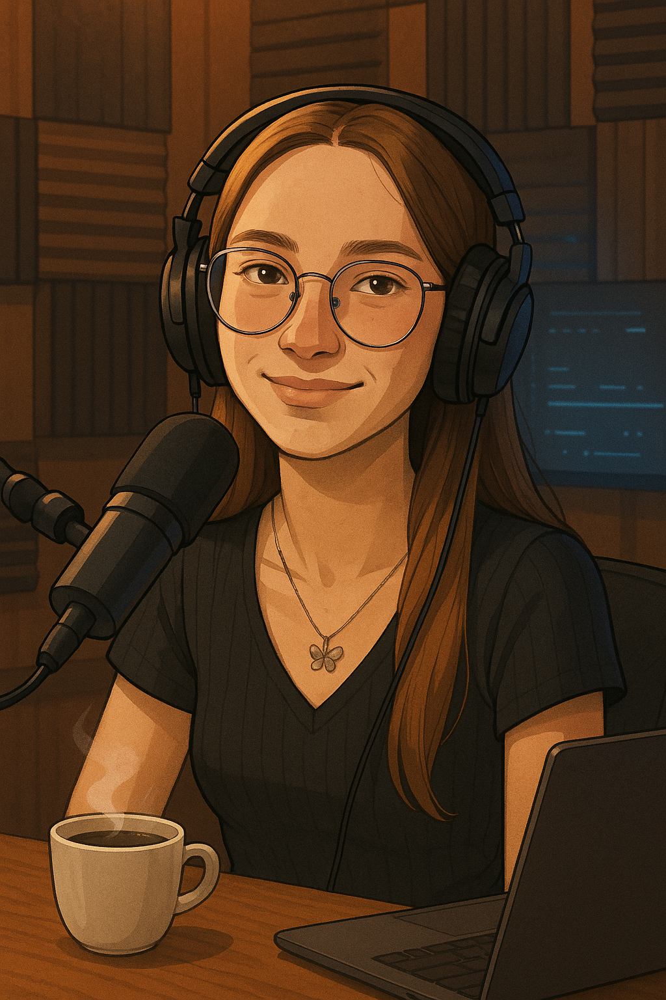

    preview do podcast

    <audio src="output/podcast_final.MP3" controls title="Podcast editado"></audio>

# Projeto Podcast Gerado por I.A.s

> ℹ️ **NOTE:** Este é o repositório foi forkado e desenvolvido para o curso online da Dio. Link para o original: https://github.com/felipeAguiarCode/prompts-for-podcast-generate-by-ia

Projeto com o objetivo de gerar um podcast utilizando ferramentas de IA através de prompts mais trabalhados.

Utilizar uma esteira de prompts para gerar cada etapa do processo criativo.

## 💻 Tecnologias utilizadas no projeto

- [ChatGPT](https://chat.openai.com/)
- [ElevenLabs](https://beta.elevenlabs.io/)
- [Cipchamp](https://clipchamp.com/pt-br/)

## ✨ Como foi feito ?

- Roteiro, título e capa gerado via chatgpt
- Audio gerado pela elevenLabs
- Clipchamp para adicionar sons de fundo

---

alterado por Amanda ✨
